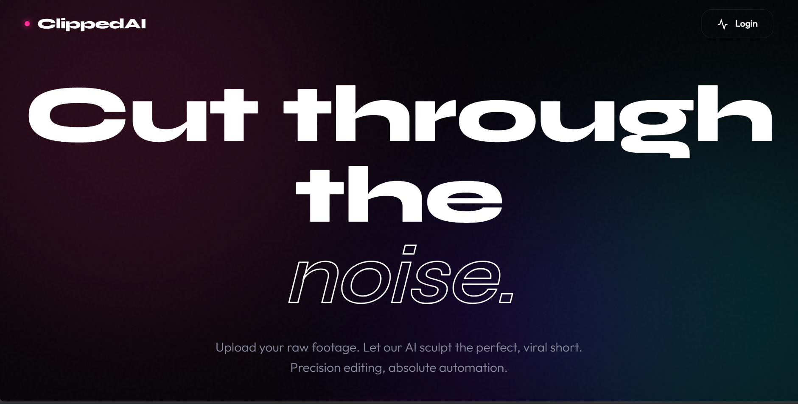
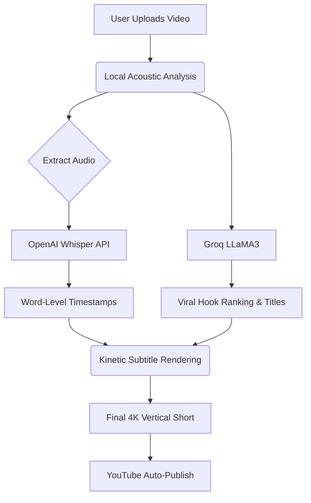

<div align="center">
  
# 🎬 ClippedAI: Autonomous YouTube Shorts Generator

<p align="center">
  
  
  
  
  
</p>

### 🔴 [Live Demo: https://clippedai.onrender.com](https://clippedai.onrender.com)

<div align="center">
  
</div>

<br>

An end-to-end, production-ready SaaS application that autonomously transforms long-form videos into viral YouTube Shorts using advanced acoustic heuristics, OpenAI Whisper, and Groq's LLaMA3.

</div>

---

## ✨ Features

- 🧠 **Algorithmic Hook Detection**: Uses acoustic analysis (energy, RMS, WPM) combined with **Groq LLaMA3** to automatically isolate high-dopamine, viral moments from hours of raw footage.
- ⚡ **Cloud AI Pipeline**: Compresses and streams audio to **OpenAI Whisper API** for blazing-fast, word-level timestamps.
- 🎨 **Kinetic Typography**: Automatically renders highly-engaging, animated captions using `ffmpeg` and `moviepy` that scale and pop to retain viewer attention.
- 🔐 **Google OAuth 2.0**: Secure user authentication and dashboard gating.
- 💳 **Razorpay Monetization**: Fully integrated payment gateway to purchase generation credits.
- 📺 **YouTube Auto-Publishing**: Users can link their YouTube channels to automatically render and broadcast shorts while they sleep.
- 🛠️ **Dev-Mode Fallbacks**: Seamlessly bypasses Google Auth and Razorpay when testing locally without API keys!

## 🏗️ Architecture



## 🚀 Quick Start (Local Development)

We've built a **Dev-Mode Bypass** so you can test the entire dashboard and generation pipeline immediately, even before you set up your API keys!

### 1. Clone & Install
```bash
git clone https://github.com/YourUsername/ClippedAI.git
cd ClippedAI

# Create virtual environment
python -m venv venv
source venv/bin/activate  # Or `.\venv\Scripts\activate` on Windows

# Install dependencies
pip install -r requirements.txt
```

### 2. Environment Variables
Copy the template to create your `.env` file:
```bash
cp .env.template .env
```
*(Leave the dummy keys as they are to test the Dev-Mode bypass, or insert your real keys to use production services).*

### 3. Run the App
```bash
python app.py
```
Visit `http://localhost:5000`. Click **Login**, and the system will instantly drop you into the Founder dashboard!

## ☁️ Production Deployment (Render)

This repository includes a production-ready `Dockerfile` optimized to run the heavy AI pipeline on extremely low memory (fitting within Render's Free Tier!).

1. Go to **Render.com** and create a New Web Service.
2. Connect this GitHub repository.
3. Add your real API keys as **Environment Variables**.
4. Deploy! Render will automatically install Python, `ffmpeg`, and Gunicorn using the Dockerfile.

## 📦 Tech Stack

- **Backend:** Python, Flask, SQLAlchemy, Gunicorn
- **Frontend:** Vanilla JS, CSS Glassmorphism UI
- **Video Processing:** FFmpeg, MoviePy
- **AI Models:** OpenAI Whisper (Transcription), Groq LLaMA3 (Hook Detection)
- **Integrations:** Google Cloud OAuth, Razorpay, YouTube Data API v3

## 📝 License

Distributed under the MIT License. See `LICENSE` for more information.
